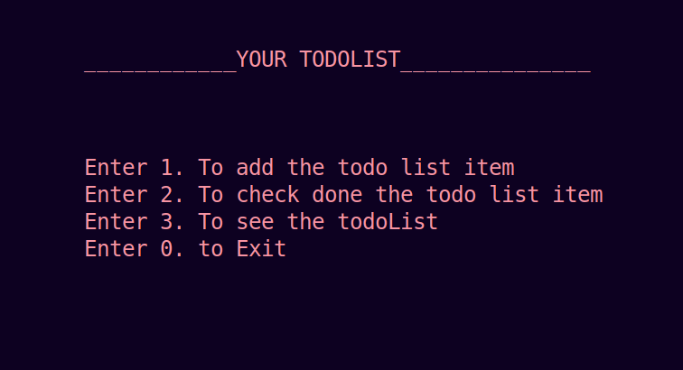

<div align="center">

</div>

<h1 align="center" style="font-size: 80px;" >TodoList App with Single LindList in CPP <h1>

### Author: [MUHIB ARSHAD](https://github.com/muhib7353)

> "TodoList App with Single LinkedList in CPP" is a command-line to-do list manager that utilizes a single linked list data structure. Users can add, remove, and mark items as done using unique IDs that are handled dynamically. Additional features include inserting items at specific positions and displaying current list. The app also includes an option to exit the program. It's a powerful and flexible tool that helps users stay organized.

# Features 🚀

- A command-line application that allows users to manage their to-do lists using a single linked list data structure.
- Has a user-friendly interface that allows users to easily add, remove, and check off items on their to-do lists.
- Uses a dynamic option to add new to-do list items.
- When the user first opens the app, there is only one option to add a new to-do list.
- As the user adds more items to their list, additional options become available, such as the ability to add new items at the start or bottom of the list, or to - - - Insert items at specific locations in the middle of the list.
  includes a feature for marking items as "done" and removing them from the list using their unique ID.
- The ID of each item is handled dynamically, so that as items are added or removed from the list, the IDs are updated automatically at runtime.
- Includes a feature for displaying the current to-do list, making it easy for users to keep track of their tasks.
- Includes an option to exit the program.
- Is a powerful and flexible tool for managing to-do lists, designed to make it easy for users to stay organized and on top of their tasks.

# How to use it 💻

- To get started, clone the repository:

```sh
git clone https://github.com/muhib7353/Secret-Messages-App-MERN.git
```

- `install` the `vscode` if not
- Open the folder in the `VScode`
- Then open the todlist_project.cpp file and execute it with the shortcut `ctrl+alt+n`

## Last Step

- Star 🌟 this repository and follow at [muhib7353](https://github.com/muhib7353)

🤝 Contributing

"Feel free to contribute to this repository. If you want to add new features or resolve any issues, you can fork the repository and make changes to the code. If you only want to make changes to the file, you can create a pull request to the master branch. I will review it and, if it meets the necessary requirements, I will merge it into the branch. The same process applies for changes to the main branch as well."

# About me

### 👨‍💻 Muhib Arshad

   <div align="center">
<p align="center">Let's connect!</p>

<a href="https://www.linkedin.com/in/muhib-arshad-85439b242/" target="blank">
    
</a>

<a href="https://medium.com/@muhibarshad123" target="blank">
    
</a>

<a href="https://stackoverflow.com/users/18215817/muhib-arshad?tab=profile" target="blank">
    
</a>

<a href = "https://twitter.com/muhib7353" target="blank">
    
</a>

<a href="https://www.facebook.com/muhib7353/" target="blank">
    
</a>

<a href="https://www.instagram.com/muhib7353/" target="blank">
    
</a>

</div>

## Show your support

If this project was helpful to you, please consider giving it a ⭐️.
You can also follow my GitHub profile to stay updated on my latest projects:
<a href="https://github.com/muhib7353" target="blank">
@muhib7353
</a>

## 📝 License

Copyright © 2022 [Muhib Arshad](https://github.com/muhib7353).

This project is [MIT](/License.md) licensed.
